# Búsquedas dinámicas con Criteria y JPA

Esta guía describe cómo se reciben, validan y ejecutan las búsquedas dinámicas de esta API. También muestra cómo llevar el patrón a otro módulo o proyecto con un schema distinto, manteniendo Spring Boot, JPA y la arquitectura hexagonal.

Se distingue entre el comportamiento que ya existe en el código y las validaciones recomendadas para que un endpoint nuevo no acepte atributos u operadores arbitrarios.

## 1. Flujo y responsabilidades

El request es dinámico porque el cliente envía el nombre del campo y el operador en el JSON. `CriteriaAdapter` convierte ese contrato HTTP al modelo compartido `Criteria`, que el caso de uso entrega al puerto de repositorio; la implementación de infraestructura construye una consulta JPA tipada para la entidad seleccionada.

```mermaid
flowchart LR
    A[JSON de búsqueda] --> B[Request de infraestructura]
    B --> C[Bean Validation y allowlist]
    C --> D[CriteriaAdapter]
    D --> E[Criteria del dominio compartido]
    E --> F[Use case]
    F --> G[Puerto del repositorio]
    G --> H[Adaptador JPA]
    H --> I[HibernateCriteriaConverter]
    I --> J[EntityManager y CriteriaBuilder]
    J --> K[(Base de datos)]
```



| Responsabilidad | Código de referencia |
|---|---|
| Modelo de búsqueda independiente de Spring/JPA | `src/main/java/com/softekpr/administrative/shared/domain/criteria/` |
| DTO HTTP y conversión a `Criteria` | `shared/infrastructure/criteria/CriteriaRestControllerRequest.java`, `FilterRestControllerRequest.java`, `CriteriaAdapter.java` |
| Traducción de `Criteria` a JPA | `shared/infrastructure/criteria/HibernateCriteriaConverter.java` |
| Allowlist de campos por request | `shared/infrastructure/validation/RestrictedCriteriaFields.java` y `RestrictedCriteriaFieldsValidator.java` |
| Ejemplo de request restringido | `agency/infrastructure/controller/agency/AgencyRelatedUserCriteriaRequest.java` |
| Endpoint y caso de uso con Criteria | `agency/infrastructure/controller/agency/AgencyRestController.java`, `agency/application/agencyCriteria/AgencyByCriteria.java` |
| Ejemplo JPA concreto de `matching` y `count` | `cesco/infrastructure/repository/dao/LocationManagementJpaRepository.java` |
| Ejemplo de interfaces Spring Data y adaptadores del módulo CESCO | `cesco/infrastructure/repository/dao/*BaseJpaRepository.java` y `*JpaRepository.java` |

Las clases de `shared/domain/criteria` no contienen anotaciones de Spring ni tipos JPA. El request y el converter pertenecen a infraestructura; el caso de uso depende de un puerto de dominio y no necesita conocer `EntityManager`.

## 2. Contrato HTTP

Un ejemplo de request para una entidad con atributos `name` e `id`:

```http
POST /location-management/criteria
Content-Type: application/json
```

```json
{
  "filters": [
    {
      "field": "name",
      "operator": "CONTAINS",
      "value": "cesco"
    },
    {
      "field": "id",
      "operator": ">",
      "value": 10
    }
  ],
  "order_by": "name",
  "order": "ASC",
  "limit": 25,
  "offset": 0
}
```

`filters` es una lista de condiciones. En `CriteriaRestControllerRequest`, cada condición tiene `field`, `operator` y `value`; `order_by`, `order`, `limit` y `offset` son opcionales. Enviar `filters: []` representa una búsqueda sin predicados. **Con el `CriteriaAdapter` actual, se debe enviar la lista vacía y no omitir `filters` ni enviarlo como `null`**, porque el adapter llama `request.getFilters().stream()`.

El endpoint de Agency relacionada a usuarios usa un contrato más específico:

```http
POST /agencies/{id}/users/criteria
```

Los campos permitidos para filtro y orden son `divisionName`, `identification`, `operatorId` y `name`, como declara `AgencyRelatedUserCriteriaRequest`. Cada endpoint debe publicar su propia lista de campos; no se debe tratar como seguro cualquier nombre recibido desde el cliente.

## 3. Validación del request dinámico

La validación tiene dos trabajos distintos:

1. **Validar la forma de cada condición.** `FilterRestControllerRequest` usa `@NotBlank` en `field` y `operator`, y `@NotNull` en `value`.
2. **Validar que el campo pertenece a la búsqueda concreta.** `@RestrictedCriteriaFields` compara `filters[*].field` y `order_by` contra allowlists definidas por el request de cada endpoint.

Ejemplo basado en `AgencyRelatedUserCriteriaRequest`:

```java
@Data
@EqualsAndHashCode(callSuper = true)
@RestrictedCriteriaFields(
        allowedFilterFields = {"divisionName", "identification", "operatorId", "name"},
        allowedOrderFields = {"divisionName", "identification", "operatorId", "name"},
        entityName = "relaciones de usuarios de agencia"
)
public class AgencyRelatedUserCriteriaRequest extends CriteriaRestControllerRequest {

    @Override
    @Valid
    public List<FilterRestControllerRequest> getFilters() {
        return super.getFilters();
    }
}
```

La anotación es de nivel de clase. `RestrictedCriteriaFieldsValidator` obtiene los campos permitidos y añade una violación si un filtro o un `order_by` contiene un atributo fuera de la lista. La validación en cascada aplica las restricciones de cada `FilterRestControllerRequest`.

La anotación por sí sola no ejecuta la validación: el parámetro del controller debe llevar `@Valid`, como en `AgencyRestController`:

```java
public ResponseEntity<?> activeAgencyUsersByCriteria(
        @PathVariable("id") Long agencyId,
        @Valid @RequestBody AgencyRelatedUserCriteriaRequest request
) {
    Criteria criteria = CriteriaAdapter.fromRequest(request);
    // Ejecutar el caso de uso con criteria.
}
```

`RestResponseExceptionHandler` transforma `MethodArgumentNotValidException` en HTTP 400 con código `VALIDATION_ERROR`. La validación también registra los nombres de los campos que fallaron.

### Límites de la validación existente

- La allowlist restringe **nombres de campos**, pero no comprueba que `operator` sea uno de los valores de `FilterOperator`. `@Schema(allowableValues = ...)` documenta Swagger; no es una regla Bean Validation.
- La allowlist omite la comprobación cuando sus arreglos están vacíos. Para endpoints públicos, declarar explícitamente los campos de filtro y orden.
- `filters` puede ser `null` según el DTO base y el validador de allowlist lo omite. Sin embargo, `CriteriaAdapter` no admite ese caso. Usar `filters: []` o hacer que el request/adapter normalice explícitamente la ausencia a `Filters.none()`.
- El endpoint actual `LocationManagementRestController.criteria` recibe el DTO genérico con `@RequestBody` pero **no** declara `@Valid` ni una allowlist específica. Es un ejemplo de conversión y matching, no de validación segura de nombres de campo.
- `CriteriaRestControllerRequest` no restringe actualmente que `order` sea `ASC`/`DESC`, ni que `limit` y `offset` sean no negativos o acotados.
- Un elemento `null` dentro de `filters` no es manejado por `RestrictedCriteriaFieldsValidator`; para aceptar entradas hostiles de forma robusta, rechazar también elementos nulos.

En un endpoint nuevo se recomienda validar también el operador y los límites. Por ejemplo, sobre el DTO del filtro:

```java
@NotBlank
@Pattern(regexp = "(=|!=|>|<|CONTAINS|NOT_CONTAINS|INCLUDES|INCLUDES_OR|IN|NOT_IN)")
private String operator;
```

Y en el request principal, agregar restricciones como `@Min(0)` en `limit` y `offset`, junto con un máximo de página acordado por el producto. Mantener sincronizados estos validadores y los valores `@Schema`: la anotación Swagger no sustituye Bean Validation. El converter actual devuelve `null` para un operador desconocido y luego intenta usarlo para seleccionar un transformer, por lo que conviene rechazar operadores desconocidos antes de convertir el request.

## 4. Conversión del HTTP al modelo `Criteria`

`CriteriaAdapter.fromRequest(request)` realiza la adaptación de infraestructura:

1. Toma cada request de filtro y extrae `field`, `operator` y `value`.
2. Construye `Filters` y objetos `Filter`.
3. Convierte `order_by` y `order` a `Order`; si no hay `order_by`, usa `Order.none()`. Si hay `order_by` y falta `order`, `Order.fromValues` usa `ASC`.
4. Conserva `limit` y `offset` como `Optional<Integer>`.

`Criteria` contiene `Filters`, `Order`, `limit` y `offset`. Los tipos principales son:

- `Filter`: `FilterField`, `FilterOperator` y `FilterValue`.
- `Filters`: lista de filtros; `Filters.none()` representa la lista vacía.
- `Order`: atributo y dirección (`ASC`, `DESC` o `NONE`).

El caso de uso trabaja con este modelo y el puerto de dominio. Por ejemplo, `AgencyByCriteria` construye un `Criteria`, invoca `AgencyRepository.matching(criteria)` y, cuando necesita total, también consulta el repositorio para el conteo. Tanto `FilterOperator.fromValue` como `OrderType.valueOf` esperan sus valores canónicos en mayúsculas; `CriteriaAdapter` no normaliza el casing del operador.

## 5. Cómo `matching` genera la consulta JPA

`LocationManagementJpaRepository` muestra el patrón corto para devolver modelos de dominio desde una entidad JPA:

```java
@Repository
@AllArgsConstructor
public class LocationManagementJpaRepository implements LocationManagementRepository {

    private final HibernateCriteriaConverter<LocationManagementEntity> criteriaConverter;

    public List<LocationManagement> matching(Criteria criteria) {
        TypedQuery<LocationManagementEntity> query =
                criteriaConverter.convert(criteria, LocationManagementEntity.class);

        return query.getResultList()
                .stream()
                .map(this::toModel)
                .toList();
    }

    @Override
    public long count(Criteria criteria) {
        TypedQuery<Long> query =
                criteriaConverter.convertToCount(criteria, LocationManagementEntity.class);
        return query.getSingleResult();
    }

    private LocationManagement toModel(LocationManagementEntity entity) {
        return new LocationManagement(
                entity.getId(),
                entity.getName(),
                entity.getDescription(),
                entity.getIsActive().equals("1"));
    }
}
```

Dentro de `HibernateCriteriaConverter`, la búsqueda sigue estos pasos:

1. Obtiene un `CriteriaBuilder` del `EntityManager`.
2. Crea `CriteriaQuery<T>` y `Root<T>` para la clase de entidad que recibió (`LocationManagementEntity.class`).
3. Transforma cada `Filter` a un `Predicate` según su operador y aplica el conjunto con `where(...)`. Los filtros se pasan como predicados separados a JPA, por lo que se combinan como condiciones AND.
4. Agrega el orden estable y, si se especificaron, `setMaxResults(limit)` y `setFirstResult(offset)`.
5. Crea y devuelve un `TypedQuery<T>`; el adaptador ejecuta `getResultList()` y mapea entidad → dominio.

La conversión usa la API tipada de JPA (`CriteriaBuilder`, `CriteriaQuery`, `Root`, `Predicate`); no concatena valores de filtro en SQL. El nombre del campo sí se usa para resolver `root.get(field)`, por lo que **debe estar restringido por allowlist y coincidir con una propiedad persistente de la entidad**.

### Propiedad Java frente a nombre de columna/schema

En `LocationManagementEntity`, por ejemplo:

```java
@Column(name = "NAME")
private String name;
```

El filtro debe usar `"field": "name"` porque `Root.get()` recibe el atributo Java de la entidad. No debe usar `"NAME"` (columna física), salvo que ese también sea el nombre del atributo Java. JPA resuelve la columna física mediante `@Column`.

El entity de CESCO es además `@Immutable` y se construye con `@Subselect` sobre `SEC_CESCO`. Los nombres que puede recibir el converter son las propiedades mapeadas en `LocationManagementEntity` (`id`, `name`, `description`, `isActive`), no nombres arbitrarios del SQL subyacente.

## 6. Operadores implementados

Los valores siguientes provienen de `FilterOperator` y de los transformers registrados en `HibernateCriteriaConverter`:

| JSON `operator` | Predicado aproximado | Uso y observaciones |
|---|---|---|
| `=` | `equal` | Igualdad. Para strings, el converter normaliza mayúsculas y acentos. |
| `!=` | `notEqual` | Desigualdad. También normaliza strings. |
| `>` | `greaterThan` | Mayor que; requiere un atributo comparable y valor convertible al tipo de la entidad. |
| `<` | `lessThan` | Menor que; requiere un atributo comparable y valor convertible al tipo de la entidad. |
| `CONTAINS` | `like '%valor%'` | Búsqueda parcial, sin distinguir mayúsculas ni acentos. Escapa `%`, `_` y `\\` para tratarlos como literales. |
| `NOT_CONTAINS` | `notLike` | Negación de la búsqueda parcial anterior. |
| `IN` | `path in (...)` | La implementación interpreta el valor como texto separado por comas, por ejemplo `"1,2,3"`, y convierte cada elemento al tipo de la propiedad. |
| `NOT_IN` | `not (path in (...))` | Negación de `IN`. Un valor vacío produce una condición neutra. |
| `INCLUDES` | `like` sobre lista delimitada | Para campos almacenados como texto separado por comas; compara cada valor con delimitadores para evitar coincidencias parciales. Si hay varios valores, todos deben estar presentes (AND). No es el operador SQL `IN`. |
| `INCLUDES_OR` | `like` sobre lista delimitada | Variante de lista en la que basta que coincida uno de los valores (OR). |

El valor de `FilterRestControllerRequest` es `Object`. `FilterValue` lo convierte a texto antes de la comparación y transforma booleanos Java a `"1"`/`"0"`. El converter convierte explícitamente boolean, integer, long, `Date` y `Timestamp`; otros tipos terminan como texto. Si el schema nuevo usa, por ejemplo, `BigDecimal`, `LocalDate`, UUID o enums, hay que agregar la conversión apropiada y probarla. No hay un operador específico para `IS NULL`; mandar `value: null` no es una forma válida de expresarlo.

`FilterRestControllerRequest` enumera en `@Schema` solo una parte de los operadores: esa metadata no coincide plenamente con el enum (no lista, entre otros, `IN`, `NOT_IN` e `INCLUDES_OR`). Al exponer esos operadores en otro endpoint, actualizar la documentación Swagger y la validación de runtime de manera conjunta.

La normalización de texto llama a la función SQL `translate` y luego aplica `lower`; el valor del request se normaliza en Java quitando marcas diacríticas. Al cambiar a un motor SQL distinto, verificar que la función exista con la semántica esperada o reemplazarla por la función/dialecto de ese motor.

## 7. Orden, paginación y conteo

- Si no se especifica orden, el converter ordena por el único atributo `@Id` ascendente, cuando la entidad tiene exactamente un ID. Esto da páginas deterministas.
- Si se solicita un orden, se usa `order_by` y la dirección indicada. Cuando existe un ID único distinto del campo principal, añade el ID como desempate en la misma dirección.
- `convertToCount` crea un `CriteriaQuery<Long>` y aplica filtros, pero no aplica `limit`, `offset` ni ordenamiento.
- `convertDistinct` y `convertToDistinctCount` permiten solicitar resultados/conteos distintos si una ampliación con joins pudiera duplicar filas.
- En el flujo de `LocationManagementByCriteria.executeWithTotal`, el conteo se construye con los mismos filtros y orden, pero con `Optional.empty()` para `limit` y `offset`.

Validar límites antes de llamar a JPA: el converter pasa `limit` y `offset` directamente a `setMaxResults` y `setFirstResult`.

## 8. Cómo implementarlo en otro proyecto o schema

El schema físico puede cambiar sin cambiar el contrato de `Criteria`. Se reemplazan la entidad, las allowlists, el puerto y el mapeo a dominio según el proyecto nuevo.

### 8.1 Mapear una entidad al schema nuevo

Por ejemplo, un proyecto CRM podría mapear sus nombres físicos con `@Table` y `@Column`:

```java
@Entity
@Table(name = "CUSTOMER", schema = "CRM")
public class CustomerEntity {

    @Id
    @Column(name = "CUSTOMER_ID")
    private Long id;

    @Column(name = "CUSTOMER_NAME")
    private String name;

    @Column(name = "EMAIL_ADDRESS")
    private String email;
}
```

En el request se aceptan `id`, `name` y `email`, que son propiedades Java persistentes. El hecho de que la tabla se llame `CRM.CUSTOMER` o que la columna física sea `EMAIL_ADDRESS` no cambia el valor de `field`.

### 8.2 Mantener el puerto en Domain y el caso de uso en Application

El puerto expresa operaciones del dominio y usa el modelo compartido `Criteria`; no extiende `JpaRepository`:

```java
public interface CustomerRepository {
    List<Customer> matching(Criteria criteria);
    long countByCriteria(Criteria criteria);
    Customer save(Customer customer);
}
```

El caso de uso recibe filtros/orden/paginación o un `Criteria`, invoca este puerto y arma el resultado de aplicación. No importa `EntityManager`, `CriteriaBuilder` ni entidades JPA.

### 8.3 Definir el request específico y su allowlist

```java
@Data
@EqualsAndHashCode(callSuper = true)
@RestrictedCriteriaFields(
        allowedFilterFields = {"id", "name", "email"},
        allowedOrderFields = {"id", "name", "email"},
        entityName = "clientes"
)
public class CustomerCriteriaRequest extends CriteriaRestControllerRequest {

    @Override
    @Valid
    public List<FilterRestControllerRequest> getFilters() {
        return super.getFilters();
    }
}
```

Declarar los campos de acuerdo con la entidad concreta consultada y la necesidad del consumidor, no copiando una lista global. Si el contrato público usa alias que no son propiedades persistentes, traducir esos alias explícitamente en el adaptador/repository o diseñar una capa de mapping; no pasar el alias a `root.get()` sin una traducción válida.

### 8.4 Usar Spring Data `BaseJpaRepository` junto al adaptador concreto

En el módulo CESCO se sigue el patrón de una interfaz `*BaseJpaRepository` que extiende Spring Data `JpaRepository` y una clase `*JpaRepository` que implementa el puerto de dominio y adapta/mapea sus datos. Por ejemplo, `CescoBaseJpaRepository extends JpaRepository<CescoEntity, Long>` y `CescoJpaRepository implements CescoRepository`.

Para un proyecto nuevo, una interfaz base podría ser:

```java
public interface CustomerBaseJpaRepository
        extends JpaRepository<CustomerEntity, Long> {
}
```

La implementación del puerto puede usar la interfaz base para CRUD derivado y `HibernateCriteriaConverter` para la búsqueda dinámica:

```java
@Repository
@RequiredArgsConstructor
public class CustomerJpaRepository implements CustomerRepository {

    private final CustomerBaseJpaRepository baseJpaRepository;
    private final HibernateCriteriaConverter<CustomerEntity> criteriaConverter;

    @Override
    public List<Customer> matching(Criteria criteria) {
        return criteriaConverter.convert(criteria, CustomerEntity.class)
                .getResultList()
                .stream()
                .map(this::toModel)
                .toList();
    }

    @Override
    public long countByCriteria(Criteria criteria) {
        return criteriaConverter.convertToCount(criteria, CustomerEntity.class)
                .getSingleResult();
    }

    @Override
    public Customer save(Customer customer) {
        return toModel(baseJpaRepository.save(toEntity(customer)));
    }

    // toModel/toEntity traducen entre la entidad de infraestructura y el modelo de dominio.
}
```

En un repositorio que solo haga búsquedas sobre una vista o `@Subselect` de solo lectura, como `LocationManagementJpaRepository`, puede no hacer falta una interfaz `BaseJpaRepository`; el adaptador consulta directamente mediante el converter. `BaseJpaRepository` y el converter resuelven necesidades distintas: Spring Data cubre CRUD/queries conocidas y el converter arma predicados dinámicos.

### 8.5 Conectar endpoint, adapter y use case

El controller valida el request, lo convierte con el adapter compartido y entrega el resultado al caso de uso:

```java
@PostMapping("/criteria")
public ResponseEntity<CustomerCriteriaResult> search(
        @Valid @RequestBody CustomerCriteriaRequest request) {

    Criteria criteria = CriteriaAdapter.fromRequest(request);
    CustomerCriteriaResult result = customerByCriteria.executeWithTotal(
            criteria.filters(),
            criteria.order(),
            criteria.limit(),
            criteria.offset()
    );
    return ResponseEntity.ok(result);
}
```

El resultado debe mapear entidades a modelos/dtos apropiados. No devolver directamente entidades JPA desde el controller: eso mezcla infraestructura con el contrato HTTP y puede exponer relaciones/columnas no destinadas a la respuesta.

## 9. Campos que no son atributos directos de la entidad

El converter base resuelve filtros con `root.get(field)`, es decir, propiedades de primer nivel de la entidad consultada. No resuelve automáticamente:

- una propiedad de otra entidad mediante notación como `agency.name`;
- un filtro calculado que no esté mapeado en la entidad;
- una relación que requiera join o una consulta adicional.

Para esos casos, escoger una estrategia explícita:

1. Añadir joins/expresiones controlados a un converter o query específica, con allowlist.
2. Traducir el filtro público a un filtro directo de entidad antes de llamar al converter.
3. Resolver el campo fuera de la consulta principal y convertirlo, por ejemplo, a un `IN` sobre IDs.

El módulo Agency contiene lógica de matching especializada para `agencyTypeId`; sus pruebas `AgencyJpaRepositoryCriteriaFilterTest` verifican que ese filtro se traduzca a una condición sobre `id` con `IN`/`NOT_IN` antes de invocar el converter genérico. Este tipo de adaptación debe cubrirse con pruebas, además de validar el filtro público.

## 10. Pruebas recomendadas

Al añadir un endpoint de Criteria en otro módulo, probar por separado:

- **Request/validación:** faltan `field`, `operator` o `value`; campo de filtro no permitido; `order_by` no permitido; operador desconocido; límites negativos o superiores al máximo.
- **Adapter:** filtros, orden, dirección, `limit` y `offset` se convierten correctamente; filtros vacíos se representan de forma segura.
- **Caso de uso:** llama al puerto con los filtros/paginación esperados y solicita el total sin aplicar paginación.
- **Adaptador JPA:** entidad correcta, mapeo entidad → dominio, conteo y transformaciones especiales de filtros.
- **Converter:** tipos, operadores, escape de comodines, normalización textual, orden estable y paginación.

En este repo son referencias `src/test/java/com/softekpr/administrative/shared/infrastructure/criteria/FilterRestControllerRequestValidationTest.java`, `HibernateCriteriaConverterTest.java` y `agency/infrastructure/repository/dao/AgencyJpaRepositoryCriteriaFilterTest.java`. Para validación de campos en un request nuevo, agregar pruebas específicas de `@RestrictedCriteriaFields` y del endpoint con `@Valid`.

## 11. Lista de verificación para migrar el patrón

- [ ] Crear/identificar entidad JPA y mapear tabla, schema, columnas e ID.
- [ ] Definir qué propiedades Java se permiten en `field` y `order_by`.
- [ ] Crear un request específico con `@RestrictedCriteriaFields`.
- [ ] Asegurar `@Valid` en el parámetro `@RequestBody` y validación de operadores/límites.
- [ ] Enviar o normalizar `filters` vacío; no dejar que `null` llegue al adapter actual.
- [ ] Convertir la request con `CriteriaAdapter` y mantener el modelo del dominio separado de JPA.
- [ ] Definir el puerto de repositorio en Domain y el caso de uso en Application.
- [ ] Implementar `matching` y el conteo en el adaptador de infraestructura.
- [ ] Inyectar `HibernateCriteriaConverter<Entity>` con la entidad del schema nuevo.
- [ ] Mapear los resultados a modelos de dominio y DTOs de respuesta.
- [ ] Extender la conversión de tipos/funciones SQL si el nuevo motor o schema lo requiere.
- [ ] Probar allowlists, operadores, paginación, orden, count y campos que necesiten mapping especial.
